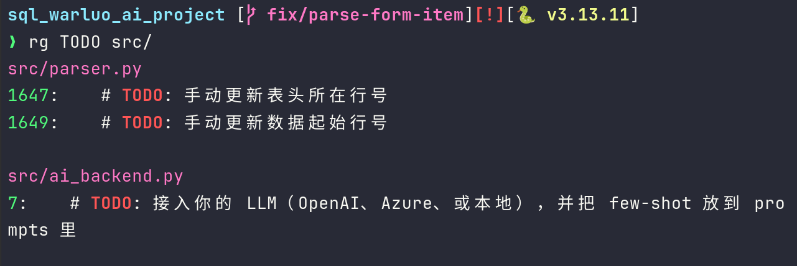

# 阶段A 2026-01-16

> 检索 → 阶段 → 排序 → 聚合 → 验证

______________________________________________________________________

## A.0 阶段A 的核心目标

当阶段A结束时, 应该能不加思索得写出并理解下面这种命令:

```bash
rg ERROR app.log | awk '{print $NF}' | sort | uniq -c | sort -nr | head
```

______________________________________________________________________

## A.1 检索(`rg`) -- 把"海量文本"变成"候选文本"

`rg`的任务只有一个: 尽可能快、尽可能准确地 **缩小数据集** 。

因此，不应该用`rg`做 **统计** 、**排序**、**复杂逻辑**.
只需要用 rg 尽可能把相关的行筛选出来

______________________________________________________________________

### 基础用法

参照 [rg 基础用法](<../2026-01-12/index.md#ripgrep(rg)-%E7%8E%B0%E4%BB%A3%E6%96%87%E6%9C%AC%E6%90%9C%E7%B4%A2%E6%A0%B8%E5%BF%83%E5%B7%A5%E5%85%B7>)

默认行为：

- 递归搜索
- 忽略二进制
- 遵循 `.gitignore`
- 输出: `文件名:行号:内容`

### 高频用法

**显示行号**：

```bash
rg -n ERROR
```

**忽略大小写**:

```bash
rg -i error
```

**限定文件类型**:

```bash
rg ERROR -t log
rg TODO -t py
```

> 在代码仓库里搜索，优先加 `-t`

### 文件级别输出

```bash
rg TODO -l # 只输出文件名
```

这一句的语义非常关键：

> 从 "行级文本" 变成 "文件集合"

后面会大量接到 `xargs`

### 练习A.1

1. 在代码仓库中:

- 搜索 `TODO`



2. 尝试:

```rg
rg TODO
rg TODO -l
rg TODO -l | wc -l
```


- `rg TODO` 打印文件名:行号:内容
- `rg TODO -l`: 只打印所在的文件
- `rg TODO -l | wc -l`: 统计有多少文件包含`TODO`

______________________________________________________________________

## A.2 截断(head/tail) -- 控制规模，防止爆炸

### 为什么"截断"是独立一步

因为Shell管道没有分页保护，如果直接 `rg ERROR huge.log`, 可能会导致:

- 卡住终端
- 丢失重要信息
- 无法判断方向是否正确

因此，需要在打印时加上head/tail进行限定。

### head: 样本验证器

```bash
rg ERROR app.log | head -n 20
```

能够快速判断 head之前的管道是否在做正确的事情。

### tail: 尾部/实时

```bash
tail -n 50 app.log
tail -f app.log
```

与 rg 结合:

```bash
rg ERROR app.log | tail -n 10
```

## A.3 计数(wc) -- 量化

### wc 的定位

> wc = 规模感知器

可以使用 `wc` 来查看有多少行、有多少结果、过滤结果是否合理等。

______________________________________________________________________

### 最重要的用法

```bash
wc -l # 查看行数
```

### 与 rg 结合

```bash
rg ERROR app.log | wc -l # 判断问题严重程度
rg TODO src/ | wc -l
```

## A.4 排序(sort) -- 使文本初步结构化

### sort 在流程中的位置

> 永远在筛选之后
> 几乎永远在 `uniq`之前

### 基础行为

```bash
sort
```

- 按照字符串
- 升序排序
- 默认全行比较

### 高频参数

```bash
sort -n # 按照数值排序
sort -r # 反序排序
sort -u # 去重(全文去重，谨慎使用)
```

### 工程常用示例

```bash
rg ERROR app.log | sort
rg ERROR app.log | awk '{print $NF}' | sort
```

### 辨析: `sort -u` 与 `uniq`

**sort -u**:
在**排序过程中**去重(同一key的记录只保留一条)

**sort | uniq**:
先完整排序，再由uniq对**相邻行**去重

`uniq` 只能去除连续的相邻行，因此必须先 sort, 否则uniq的去重不会生效。

#### 会产生不同结果的场景

##### 不同 key 定义时

```bash
sort -u -k1,1 file
```

`sort -u`的语义时：

> 如果排序的key(这里是第一个字段的第一个字符), 只保留其中一条完整记录。

```bash
sort -k1,1 | uniq
```

`uniq`比较的是整行，不是指定的key.因此对于如下示例:

```text
a 1
a 2
```

- 执行 `sort -u -k1,1` 的输出(只保留一行)：

```text
a 1
```

- 执行 `sort -k1,1 | uniq` 的输出(两行都保留):

```text
a 1
a 2
```

#### 从数据安全性角度看

- `sort -u`: 强去重
  - 性能更高
  - 假设数据是干净的
  - 假设重复是噪音
  - 优先性能和结果一致性
- `sort | uniq`: 保守去重
  - 假设数据可能是脏的
  - 假设重复可能是信号
  - 优先可审计性与可回溯性

### 补充: sort -k 用法

#### sort -k 是什么

`sort -k` 用于指定 **排序键**

> 默认情况下，`sort` 以整行作为比较对象。
> 使用 `-k` 后，`sort`只对指定的字段/字符范围进行比较

#### `-k`的完整语法

```bash
sort -k start[,end][其他选项]
```

##### start(必填)

start 可写为如下形式：

```bash
start_field[.start_char1]
```

- start_field: 从第几个字段开始
- 选中该字段中的第几个字符

##### end(可选)

end 可写成如下形式:

```bash
end_field[.end_char]
```

- 省略end -> 从start到行尾
- 指定end -> 精确控制排序范围

#### 字段(field)是如何切分的

默认规则: 字段分隔符 = 空白(连续的空格/tab)

示例:

```text
aa     bb          cc
```

字段是：

|字段号|内容|
|:-----|:---|
|1|aa|
|2|bb|
|3|cc|

**自定义分隔符**:

```bash
sort -t ':' -k2,2
```

- `-t`: 指定冒号为分隔符
- `-k`: 只基于指定的分隔符进行字段切分(默认空格)

#### 常见用法

##### 按第N个字段排序

```bash
sort -k2,2
```

含义：只按照第2个字段排序，不看其他字段。
如果不写 `,2`(指定end)，就等价于:

```bash
sort -k2,999
```

即：从第二个字段开始，后面的所有字段都会参与排序。这通常不符合要求。

##### 按字段+数值排序

```bash
sort -k2,2n
```

- n: numeric sort(数值)
- 否则是字段序

比如对于:

```text
a 2
b 10
```

如果执行 `sort -k2,2`，则结果为:

```text
b 10
a 2
```

如果执行 `sort -k2,2n`, 结果为:

```text
a 2
b 10
```

##### 多键排序(主键+次键)

```bash
sort -k1,1 -k2,2n
```

- 先按照第1列排序
- 如果相同，再按照第2列数值排序

与 **SQL ORDER BY a, b** 的含义相同。

##### 指定字符范围排序

```bash
sort -k1.2,1.4
```

示例:

```text
a123
a045
```

排序依据:

```text
123
045
```

适用于前缀固定、后缀有意义的日志/编码

#### 需要注意

##### Note1: -u 与 -k 的组合语义

```bash
sort -u -k1,1
```

含义是: key相同 -> 整行只保留一条

##### Note2: 排序key 不是只输出key

```bash
sort -k2,2 file
```

- 排序依据: 第二列
- 输出结果: 整行

##### Note3: -k1 几乎永远似乎错误用法

`sort -k1`: 从第一列开始，到行尾全部参与排序。这在绝大多数情况下都是不符合需求的，
更常见的是指定`start,end`

## A.5: 聚合(uniq) -- 统计与去重

**非常重要的原则**:

`uniq` 只能处理相邻重复行.

因此，`sort | uniq` 是标准形态。

______________________________________________________________________

错误示例:

```bash
rg ERROR app.log | uniq
```

这里uniq只能合并相邻的重复行，结果不可信

## 阶段A小结

本节完成了:

- 文本缩小(rg)
- 规模控制(head/wc)
- 结构显现(sort)
- 统计聚合(uniq)

下一阶段B将会进行 行 -> 字段 -> 语义结构 的跃升
