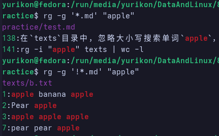

# Shell 的基本命令与命令行中哲学

## Shell命令的三种类型

在Fedora终端中，当输入一行命令时，Shell会去三处地方寻找：

|类型|示例|特征|查找方式|
|:--|:--|:--|:-------|
|内建命令(builtin)|`cd`,`echo`,`exit`,`history`,`export`|由Bash自身提供，不需要外部程序|直接在Shell内执行，速度最快|
|外部命令(external)|`ls`,`cat`,`grep`,`find`,`tar`|系统中的可执行文件|Shell通过`$PATH`搜索到`/usr/bin/ls`之类的|
|函数或脚本|自己写的`deploy.sh`|用户定义|只要文件有执行权限且在PATH中即可|

## 命令的执行逻辑

一条命令的执行过程是这样的：

### 解析输入

Shell把命令行拆分为“命令+参数”

```bash
ls -l /etc
# 命令=ls, 参数=["-l", "/etc"]
```

### 查找命令来源

按内建->PATH顺序查找

### 创建子进程执行

外部命令通过 `fork` -> `exec` 启动新进程

### 返回退出码 `$?`

命令结束时，返回一个整数状态码：

- 0表示成功
- 非0表示失败或错误

例如：

```bash
ls /etc
echo $?
```

## 命令的通用结构

几乎所有的命令都遵循相同结构：

> 命令 [选项] [参数]

例如：

```bash
ls -l /etc
grep -i "bash" /etc/passwd
cp file.txt backup/
```

- 选项(option)：以 `-`或 `--`开头(短选项/长选项)
- 参数(argument)：命令要处理的目标对象

查看帮助的三种方式：

```bash
man ls
ls --help
info ls
```

## Fedora的常用命令

### 文件与目录管理

| 命令 | 功能 | 示例 |
|:----|:-----|:----|
|`pwd`|显示当前目录|`pwd`|
|`ls`|列出目录内容|`ls -lah`|
|`cd`|切换目录|`cd /etc`|
|`mkdir`|创建目录|`mkdir logs`|
|`rmdir`|删除空目录|`rmdir old`|
|`cp`|复制文件或目录|`cp a.txt b.txt`|
|`mv`|移动/重命名|`mv old new`|
|`ln`|创建软连接/硬连接|`ln -s /opt/app /usr/local/bin/app`|

### 文件内容查看

|命令|功能|示例|
|:--|:---|:---|
|`cat`|打印文件内容|`cat /etc/os-release`|
|`tac`|倒序打印|`tac file.txt`|
|`less`|分页查看|`less /var/log/dnf.log`|
|`head`|查看前N行|`head -n 5 file.txt`|
|`tail`|查看后N行|`tail -f /var/log/messages`|

### 过滤与搜索

|命令|功能|示例|
|`grep`|文本内容匹配(支持正则)|`grep bash /etc/passwd`|
|`find`|文件搜索|`find /etc -name "*.conf"`|
|`locate`|使用数据库快速查找文件|`sudo updatedb && locate passwd`|

### 压缩与存档

|命令|功能|示例|
|:--|:--|:---|
|`tar`|打包归档|`tar -czf logs.tar.gz logs/`|
|`unzip`|解压zip文件|`unzip demo.zip`|
|`gzip/gunzip`|压缩/解压单文件|`gzip a.txt`,`gunzip a.txt.gz`|

### 系统状态与进程管理

|命令|功能|示例|
|`ps`|查看进程|`ps -ef`|
|`top`|动态查看进程|`top`|
|`free`|查看内存使用|`free -h`|
|`df`|查看磁盘使用|`df -h`|
|`du`|查看目录大小|`du -sh *`|
|`uptime`|系统运行时间|`uptime`|
|`who,w`|当前登陆用户|`who`|

### 网络与下载

|命令|功能|示例|
|`ping`|网络连通性测试|`ping -c 3 baidu.com`|
|`curl`|HTTP请求|`curl -I https://www.example.com`|
|`wget`|下载文件|`wget https://example.com/file.zip`|
|`ss`|查看端口占用|`ss -tulnp`|

### 权限与用户

|命令|功能|示例|
|`whoami`|当前用户|`whoami`|
|`chmod`|修改权限|`chmod 644 file.txt`|
|`chown`|修改文件属主|`sudo chown user:user file.txt`|
|`sudo`|以管理员权限执行命令|`sudo dnf install tree`|

### 清理与维护

|命令|功能|示例|
|`history`|查看历史命令|`history`|
|`clear`|清屏|`clear`|
|`alias`|定义命令别名|`alias ll='ls -alh'`|
|`df`,`du`|监控磁盘空间|`df -h`,`du -sh /var/log/*`|

## 常见命令及用法

### 文件与目录

#### ls-列目录

- 常用参数：
  - `-l`：长列表
  - `-a`：全部含隐藏
  - `-h`：人性化大小
  - `-t`：按时间
  - `-r`：逆序
  - `-S`：按大小
- 例子：
  - `ls -lah`：总览当前目录
  - `ls-lt /var/log | head`：看最近改动的文件
  - `ls -l --group-directories-first`：先列目录再列文件

#### cd/pwd-切换/显示目录

- `cd -`：回到上一次目录；`cd ~user`：去某用户家目录
- `pwd -P`：展开软链后的真实路径

#### mkdir/rmdir

- `mkdir -p a/b/c`：建递归目录
- `rmdir`：只能删除空目录(大多用`rm -r`)

#### cp/mv/rm/ln

- `cp -r`：递归地克隆目录;`-a`：保留属性；`-v`：显示过程；`-u`：仅复制较新
- `mv -n`：不覆盖已存在文件；`-i`：覆盖前询问；
- `rm -r`：递归地删除目录；`-f`：强制删除；`-I`：覆盖/删除大量前确认
- `ln file hard`：硬链接；`ln -s /real target`：软链接
- 例子：
  - `cp -a src/ dst/`：同步目录保留权限
  - `mv -n *.log old/`：防止覆盖地移动到old中
  - `rm -rf --one-file-system /var/tmp/*`：避免跨挂载误删除

#### du/df - 空间

- `du -sh *`：当前各项体积；`du -sh .`：目录总大小
- `df -hT`：人性化显示+文件系统内容

### 文件内容查看与流

#### cat/tac/less/head/tail

- `less -S`：不换行截断；`-N`：显示行号
- `tail -f file`追踪，`-n 200`最后200行；`-F`文件改名也跟随

#### sort/uniq/wc/cut/paste

- `sort`:链接所有文件，然后对内容排序，并将结果写到标准输出
  - 按照默认的字母顺序排序：`sort file.txt`
  - 忽略大小写顺序：`-f`
  - 按数字大小排序：`-n`
  - 逆序：`-r`
  - 按照某一列排序:`-k`
  - 删除重复行:`-u`
  - 指定分隔符:`-t`
  - 输出到指定文件(可以覆盖自己):`-o`
- `uniq`:过滤相邻的重复行
  - `uniq [option] [input [output]]`
  - 只会去除相邻的重复行，在使用前需要用`sort`进行排序:`sort file.txt | uniq`
  - 统计每行出现次数：`-c`
  - 仅显示重复的行：`-d`
  - 仅显示未重复的行：`-u`
  - 忽略大小写：`-i`
  - 忽略前n个字段比较:`-f n`
- `wc`: 快速统计文件中的行数、单词数、字符数、字节数
  - `-l`：只统计行数
  - `-w`：只统计单词数
  - `-c`：只统计字节数
  - `-m`：统计字符数
  - `-L`：输出最长行的长度
- `cut`：从文本行中提取指定的列或字符范围
  - 按照分隔符或字符位置取列
  - `-d <分隔符>`：指定分隔符(默认为Tab)
  - `-f <字段编号>`:指定提取的字段(与 `-d` 一起用)
  - `-c <范围>`：指定提取的字段范围(不依赖分隔符)
  - `--complement`：取反，取出未被选中的部分
  - `-s`：忽略不包含分隔符的行

### 搜索与定位

#### grep

- `grep`: 全局匹配正则表达式并打印匹配的行
  - `grep [选项] <模式> [文件...]`
    - `<模式>`：要查找的字符串或正则表达式
    - `[文件]`：可选，若省略则从标准输入读取
  - 忽略大小写：`-i`
  - 显示行号: `-n`
  - 匹配完整单词：`-w`，比如`grep -w "cat" pets.txt`只匹配独立的"cat"，而不是"concatenate"
  - 显示文件名：`-l`
  - 显示不匹配的行：`-v`，表示反转
  - 只统计匹配行数：`-c`
  - 只显示匹配文本部分：`-o`，只输出匹配内容，而不是整行
  - 正则表达式：默认支持正则表达式，如果想用扩展正则表达式，需要使用`-E`

#### rg

- `rg`：ripgrep，grep的现代化超速版本。在目录或文件中递归搜索文本内容
  - 比`grep`/`ack`/`ag`都更快、更智能
  - `rg [选项] <搜索模式> [路径]`
  - 忽略大小写：`-i`
  - 显示行号：默认开启
  - 仅显示文件名：`-l`
  - 只显示匹配的文本部分: `-o`
  - 指定文件类型搜索：`--type`，
    - 例如：`rg "def" --type py`/`rg "import" -t python`
  - 指定扩展名搜索：`-g`：`rg "main" -g "*.java"`
  - 反向匹配：`-v`
  - 限定输出数量：`-m`

##### rg的基本使用方式

**搜索字符串(默认递归)**

```bash
rg "hello"
```

它会：

- 自动在当前目录下递归查找
- 自动跳过`.gitignore`忽略的文件
- 自动按行打印结果
- 自动彩色显示匹配位置

--- 

**指定目录**

```bash
rg "main" ./src
```

---

**指定文件类型**

```bash
rg "class" -t java
rg "TODO" -t rust
```

查看支持的语言类型：

```bash
rg --type-list
```

##### rg的基本语法

```bash
rg [options] PATTERN [PATH...]
```

PATTERN就是默认的Rust-style正则表达式。  
例如：  
```bash
rg 'foo.*bar'
```

##### 常用匹配模式(regex概述)

rg使用Rust regex，支持：

- 字符匹配: `.`
- 多次匹配：`*`、`+`、`?`
- 字符集：`[abc]`、`[^abc]`
- 分组：`(abc)`
- 或：`foo|bar`
- 锚点：`^`、`$`
- 单词边界：`\b`、`\B`
- 重复次数：`{3}`

##### 常用option

**输出控制**

1. 只显示文件名：`rg -l "pattern"`
2. 只统计匹配数量：`rg -c "pattern"`
3. 不显示文件名：`rg -N "pattern"`

--- 

**上下文**

1. 显示上下文：
  - 行前三行：`rg -B 3 "error"`
  - 行后三行：`rg -A 3 "error"`
  - 前后各三行：`rg -C 3 "error"`

--- 

**文件类型过滤**

1. 指定语言类型：`rg -t python "import"`
2. 排除某些类型：`rg -T markdown "hello"`

--- 

**文件名过滤**

1. 指定扩展名：`rg -g '*.md' "title"`
2. 排除某文件：`rg -g '!*.min.js' "function"`
3. 搜索隐藏文件：`rg -u "pattern"`

比如：  


这里通过指定扩展名找到写在后缀为`.md`中的`apple`，并通过排除扩展名`!*.md`找到了写在其他地方的`apple`  

#### find

- `find`：按名称查找文件，还能根据时间、大小、类型、权限等几乎所有属性进行筛选，还可以对结果直接执行命令

|条件|说明|示例|
|:--|:--|:---|
|`-name <pattern>`|按名称匹配(支持通配符)|`find . -name "*.txt"`|
|`-iname <pattern>`|忽略大小写|`find .-iname "*.jpg"`|
|`-type <f/d/l>`|按照类型查找：文件(f)，目录(d)，链接(l)|`find . -type f`|
|`-size <n>`|按大小查找|`find .size +100M`|
|`-mtime <n>`|按修改时间(天)|`find . -mtime -7`|
|`-mmin <n>`|按修改时间(分钟)|`find . -mmin -30`|
|`-use <用户名>`|查找属于某用户的文件|`find /home -user yurikon`|
|`-perm <权限>`|查找权限匹配的文件|`find . -perm 644`|
|`-empty`|空文件或空目录|`find . -empty`|
|`-newer <文件>`|比某文件更新的|`find . -newer file.txt`|

- 常用匹配符号

|符号|含义|示例|
|:---|:--|:---|
|`+n`|大于n|`-size + 10M`(大于10MB)|
|`-n`|小于n|`-mtime -7`(7天内修改)|
|`n`|等于n|`-size 100k`(正好100K)|

- 与动作结合使用
  - `find`的强大之初在于，找到文件后可以直接对其进行操作
  - 打印结果(默认)
    - `find . -name "*.txt" -print`
  - 删除匹配文件
    - `find . -name "*.tmp" -delete`
  - 执行命令
    - `find . -name "*.log" -exec rm {} \;`
      - `{}`：代表找到的文件
      - `\;`：结束符号
  - 更高效的批量执行：
    - `find .-name "*.log" -exec rm -v {} +`
    - `+`代表把多个文件一次性传递给命令，比`\;`更快

- 组合条件(逻辑表达式)

|操作符|说明|示例|
|:--|:---|:----|
|`-and`/`-a`|与(默认)|`find . -type f -name "*.txt"`|
|`-or`/`-o`|或|`find .-name "*.jpg" -o -name "*.png"`|
|`!`|非|`find . ! -name "*.txt"`|

### 文本处理三剑客

#### 总览：三者定位

|命令|功能定位|核心用途|
|:--|:-----|:-------|
|`sed`|流编辑器|批量修改、替换、删除文本内容|
|`awk`|模式扫描与报告语言|按列分析、格式化输出、统计计算|
|`xargs`|参数传递器|将输入内容转化为命令行参数批量执行|

#### awk

##### awk是什么

awk是一个专门用于处理文本记录(record)和字段(field)的文本处理语言。  
它既是命令，也是一个完整的小型编程语言

awk=行处理器(按行读取) + 字段处理器(按分隔符读取) + 模式匹配(pattern) + 动作(action)

其擅长：

- 按行读取文本
- 按分隔符(默认空白)自动拆成$1, $2, $3字段
- 根据某些条件(pattern)筛选行
- 对字段做处理、计算、输出
- 支持变量、数组、函数
- 自带脚本结构

##### awk的核心逻辑

awk的处理逻辑如下：

```bash
BEGIN {...执行一次...}

对每一行：
  按分隔符拆成字段$1, $2, ... $NF
  如果满足pattern, 则执行{action}
END {...执行一次...}
```

默认行为：

- 一行=一个record
- 以空白字符为分隔符
- 字段变量：
  - `$1`：第一列
  - `$2`：第二列
  - ...
  - `$NF`：最后一列
- `NR`：当前是第几行(全局计数)
- `NF`：当前行的字段数

##### 语法格式

**总形式(完整形式)**

```bash
awk [选项] '
    BEGIN { 初始化代码块 }
    pattern1 { action1 }
    pattern2 { action2 }
    ...
    patternN { actionN }
    END   { 收尾代码块 }
' inputfile1 inputfile2 ...
```

每一行输入文件都会被 **依次匹配所有pattern->action**  
其中：

- pattern可以是正则、条件表达式、范围表达式等
- action是一段用`{}`包裹起来的awk代码
- 如果没有action,则默认action是`print $0`
- 如果没有pattern, 则对所有行执行action

---

**常见的简写形式**

- 只有action(无pattern)：  
`awk '{print $1}' file`  
表示对每一行执行`{print $1}`
- 只有pattern(无action)  
`awk '/error/ file'`  
表示：匹配正则`/error/`的行全部打印  
- 带分隔符  
`awk -F',' '{print $2}' file.csv`

---

**pattern的语法格式**

`pattern`有很多类型，都是合法的：

- 正则表达式类型：  
`$3 ~ /abc/`  
- 条件表达式(布尔表达式)  
`$2 > 100`
- 逻辑组合  
`$2 > 100 $$ NR <= 10`
- 范围模式  
`NR>=2 && NR <=10`
- BEGIN/END  
`BEGIN { ... }  
END { ... }`

---

**action(动作块)的语法格式**

`action`是一段由`{}`包裹起来的awk程序  
action中可以包括：

- print/printf
- 变量赋值
- 数学/逻辑操作
- 字符串操作
- 数组操作
- if/else
- for/while循环
- 函数调用
- 用户自定义函数

例如：
```bash
$3 > 70 {
  sum += $3
  count++
}
```

---

**内置变量语法**

|变量|语法含义|
|:---|:-------|
|`$0`|整行|
|`$1` `$2`...`$NF`|各字段|
|`NF`|字段数|
|`NR`|当前行号|
|`FS`|输入字段分隔符|
|`OFS`|输出字段分隔符|
|`RS`|默认换行|
|`ORS`|输出记录分隔符|

示例：

```bash
BEGIN {FS=","; OFS="|"}
{print $1, $3}
```

---

**awk命令行选项**

最常用选项：

|参数|含义|
|:----|:---|
|`-F <sep>`|设置输入分隔符|
|`-v var=value`|传入外部变量|
|`-f script.awk`|使用awk脚本文件|

##### 实例

**打印第一列**
```bash
awk '{print $1}' file.txt
```

**打印第一列和第三列**

```bash
awk '{print $1, $3}'
```

**只打印包含"hello"的行**

```bash
awk '/hello'
```

**筛选第二列大于100的行**

```bash
awk '$2 > 100 {print $0}' file
```

##### 数值计算：awk的最大优势之一

awk可以直接做数学运算，比shell更方便

例：求第二列的和

```bash
awk '{sum += $2} END{print sum}' file
```

例：求第二列和的平均值

```bash
awk '{sum += $2; count++} END{print sum/count}'
```

### 其他命令

#### tr

**tr是什么**

`tr`是一个字符级过滤器，它只做一件事情：  
> 从标准输入读取文本，对字符进行替换、删除、压缩，并输出到标准输出

`tr`是字节流过滤器，特别适用于：

- 大规模重复字符的修改
- 改大小写
- 删除不可见字符
- 字符集转换

**基本语法**

```bash
tr [option]... STE1 SET2
```

三类操作：

- 替换 `tr SET1 SET2`
- 删除 `tr -d SET1`
- 压缩重复字符 `tr -s SET1`

**字符集(SET)写法**

SET是一个字符集的描述，有多种格式：

|写法|意义|
|:---|:---|
|`a-z`|小写字母|
|`A-Z`|大写字母|
|`0-9`|数字|
|`[:space:]`|空白字符(空格、换行、tab)|
|`[:digit:]`|所有数字|
|`[:alpha:]`|所有字母|
|`[:lower:]`|所有小写|
|`[:upper:]`|所有大写|
|`[:punct:]`|标点符号|

例子：  
```bash
tr 'A-Z' 'a-z'
```
将全部大写替换为小写

---

**替换**

替换指定字符：  
```bash
echo "1 2 3" | tr ' ' '_'
```

输出：  
```bash
1_2_3
```

注意：

- SET1长度与SET2长度必须一致
- `tr`是逐字符映射，不是字符串替换

---

**删除(-d)**

删除所有目标字符：  

删除所有数字：  
```bash
echo "a1b2c3d4" | tr -d '0-9'
```

删除换行符(让所有内容变成一行)
```bash
tr -d `\n` < file.txt
```

删除所有**非**字母字符(使用补集)
```bash
echo "a1b2c3d4<>?()*&*(^#(*&" | tr -dc 'a-zA-Z'
```

补集`-c`意味着“不是这些的都处理”

---

**压缩重复字符(-s, squeeze)**

当某类字符连续出现时，压缩成一个

把多个空格合并成一个空格：  
```bash
echo "a   b    c" | tr -s ' '
```

把多个换行压缩成一个：  
```bash
tr -s '\n' < file.txt
```

---

**常用命令**

**行转列(列转行)**

将换行符变成空格就实现多行变成一行：  

```bash
tr '\n' ' ' < file
```

反之则将一行变成多行：  

```bash
tr ' ' '\n' < file
```

**去除Windows换行符CRLF -> LF**

```bash
tr -d '\r' < windowsfile.txt > linuxfile.txt
```

**URL处理：转大写 -> 小写**

```bash
echo "HTTP://EXAMPLE.com" | tr 'A-Z' 'a-z'
```

---

**特殊字符写法**

shell可能会拦截一些字符，需要转义：

|表示|正确写法|
|:---|:-------|
|换行符|`\n`|
|回车符|`\r`
|Tab|`\t`或实际敲一个tab|

