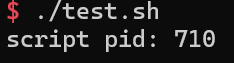
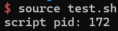

# 阶段B：Shell脚本的执行模型、结构化设计

**学习目标**:

- 能够清楚解释Shell脚本时如何被执行的
  shebang、解释器、命令逐行启动。当前Shell、子Shell、source的执行能力差异等
- 可以独立设计一个结构清晰的Shell脚本
- 理解Shell中变量、参数、引用与环境的真实规则
  引号的添加时机、`$@`与`$*`的差异来源、export的边界以及环境环境变量如何跨进程传播
- 写出具备基本健壮性的脚本
- Shell 的适用边界

______________________________________________________________________

## B1: Shell 脚本的执行模型与生命周期

这一节的核心任务是：

> 理解 一行文本从文件到执行结果，中间发生了什么

**B1的学习目标**

学习完B1, 需要能够做到:

- 解释Shell 脚本的执行流程
- 明确三种运行脚本方式的本质差异
- 理解 shebang 在 Fedora 下的解析机制
- 通过进程视角判断 是不是同一个Shell
- 通过实验验证变量、环境的存活与消失

______________________________________________________________________

## B1-1: Shell脚本的执行方式与进程模型

### B1-1.1: Shell 脚本是什么

从系统层面看，Shell 脚本只有两层含义:

第一层，它是一个**普通文本文件**.
内核并不认识Shell语法，if、for、$VAR都是给解释器看的。

第二层，它是一个**由解释器逐行读取并执行的指令流**
Shell在读取一行后，先做展开，再执行命令，然后进入下一行。

即：
Shell 脚本不是被"编译"执行的，而是解释执行，并且是顺序执行

______________________________________________________________________

### B1-1.2: 三种运行脚本的方式

#### `bash script.sh`

> 启动一个新的bash进程，用它来解释这个文件

发生的事情是:

- 当前Shell仍然存在
- 新启动一个bash(子进程)
- 脚本在子Shell中执行
- 脚本结束后，子Shell退出

脚本的变量、函数，在外面用不到。

#### `./script.sh`

- 内核发现这是一个可执行文件
- 读取文件第一行的 shebang
- 根据 shebang 指定的解释器路径
- 启动该解释器进程，并把脚本作为参数传给它

如果脚本是:

```bash
#!/usr/bin/env/ bash
```

那么等价于:

```bash
/usr/bin/env bash ./script.sh
```

其本质上，仍然是启动了一个**新的Shell进程**。

所以和 `bash script.sh` 在 "作用域" 层面是一样的。

#### `source script.sh` 或 `.script.sh`

与前两种完全不同。其含义是：

> 不启动新进程，把脚本内容当作"当前Shell的一部分"来执行。

结果是：**没有子Shell**, **脚本里的变量、函数直接进入当前环境**(cd 会真的改变目前所在的目录)

因此，配置文件必须用 `source`, 激活环境必须用 `source`

______________________________________________________________________

### B1-1.3: shebang 在 Fedora 下的真实作用

shebang 的形式是:

```bash
#!/usr/bin/env bash
```

它并不是给 bash看的，而是给内核看的。当执行 `./scripr.sh` 时，

- 内核会读取第一行
- 把 `#!` 后面的路径当作解释器
- 用该解释器启动进程

解释器路径推荐使用 `usr/bin/env bash` 的原因是：

- bash 不一定在 `/bin/bash`
- env 会从 PATH 中找 bash
- 更具有 可移植性

如果脚本没有 shebang, `./script.sh` 会直接报错；`bash script.sh` 仍然能够运行

______________________________________________________________________

### B1-1.4: 用进程视角理解Shell

在终端中输入`echo $$`会显示当前Shell 的 PID。


然后写一个脚本test.sh:

```bash
#!/usr/bin/env bash
echo "script pid: $$"
```

执行下面三种方式:

```bash
bash test.sh
./test.sh
source test.sh
```

结果如图:





前两种的 PID 不等于当前Shell, `source` 的PID完全一致

Shell是否**影响当前环境**, 取决于有没有**新进程**.

______________________________________________________________________

### B1-1.5: 脚本的生命周期总结

从开始到结束，一次Shell脚本的生命周期是:

1. 文件被读取
2. 解释器进程启动(或复用当前Shell)
3. 每一行进行展开与执行
4. 遇到exit或文件结束
5. 进程推出或返回调用点

### B1-1.6: 小练习

写一个脚本，内部 **定义变量、函数、执行一次cd**

test2.sh:

```bash
#!/usr/bin/env bash
foo='Hello, world'
function helloFunc() {
  echo $foo
}

cd ~
echo "Now You are in $(pwd)"
helloFunc
```

用三种方法执行。

- 用 `bash test2.sh` 执行时，会启动一个子进程，子进程内定义`foo`变量以及 `helloFunc()` 函数，同时切换到 `~`。执行脚本结束后，会返回到主进程所在的目录，同时子进程内创建的变量以及函数不会被传递回来。
- 用 `./test2.sh` 执行时，内核会从 shebang 指定路径中选择, 其余与 `bash` 执行一致。
- 用 `source test2.sh` 执行时，该脚本里的变量、函数会直接进入当前shell，不启用新进程。因此当前目录会被切换到 `~`, 同时也会在当前 shell 中赋值变量 `foo` 和声明函数 `helloFunc`
